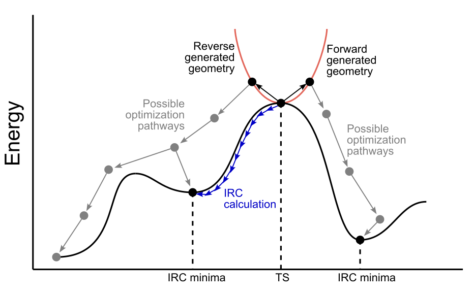

**********
distort-ts 
**********

|distortts_explanation|

.. highlight:: sh

.. argparse::
   :module: pyssianutils.input.distortts
   :func: parser
   :prog: pyssianutils distort-ts

.. highlight:: default

Usage
=====

This util has two possible applications. On one hand, we may have a minima that
has a small imaginary frequency. A relatively standard approach to try to get 
rid of said imaginary frequency is to follow the vibration in one or both 
directions and re-optimize the resulting geometries. On another hand, transition
state searches are typically complicated and running an IRC on every single 
candidate transition state might be too expensive, in comparison with two 
optimizations per transition state. This approach, can help in discarding 
transition states structures that are not the target of the study by a cheaper
computational price. Also, it provides a slightly better guarantee about 
running the IRC calculation on the non-discarded TSs.

For a given optimization to a transition state, e.g :code:`example_ts.log`, 
(requiring both, :code:`opt` and :code:`freq` keywords) and the matching input
:code:`example_ts.com` we can generate the geometries from distorting the ts by: 

.. code:: shell-session  

   $ pyssianutils distort-ts example_ts.log --no-marker
   Processing File example_ts.log

This will generate two files, :code:`example_ts_f.com` and 
:code:`example_ts_r.com` . If we also want to generate a version with a 
larger distortion we can 

.. code:: shell-session  

   $ pyssianutils distort-ts example_ts.log --factor 0.25 --marker v2
   Processing File example_ts.log

Which in turn generates the files :code:`example_ts_f_v2.com` and
:code:`example_ts_r_v2.com`. Note that if we want to modify the "r" and "f" with
a different text that we prefer we need to change our user defaults, for example:

.. code:: shell-session  

   $ pyssianutils defaults forward_mark FORWARD --section input.distortts
       setting [input.distortts][forward_mark] = FORWARD
   storing new defaults
   $ pyssianutils defaults reverse_mark REVERSE --section input.distortts
       setting [input.distortts][reverse_mark] = REVERSE
   storing new defaults

with these new defaults, running

.. code:: shell-session  

   $ pyssianutils distort-ts example_ts.log --factor 0.25 --marker v2
   Processing File example_ts.log

will instead produce the files :code:`example_ts_FORWARD_v2.com` and 
:code:`example_ts_REVERSE_v2.com`.

All of these input files will look like example_ts.com, with two major 
differences: the geometries will be the distorted ones from the ts, and any
suboptions of the :code:`opt` present in the original file, will be removed
(typically :code:`opt=(calcfc,noeigentest,ts)` will transform into :code:`opt`)
