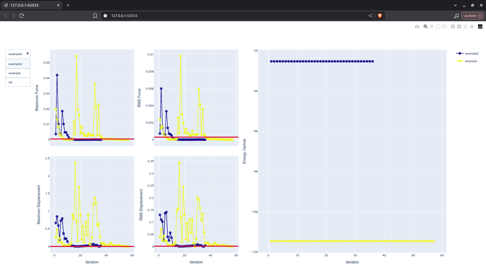
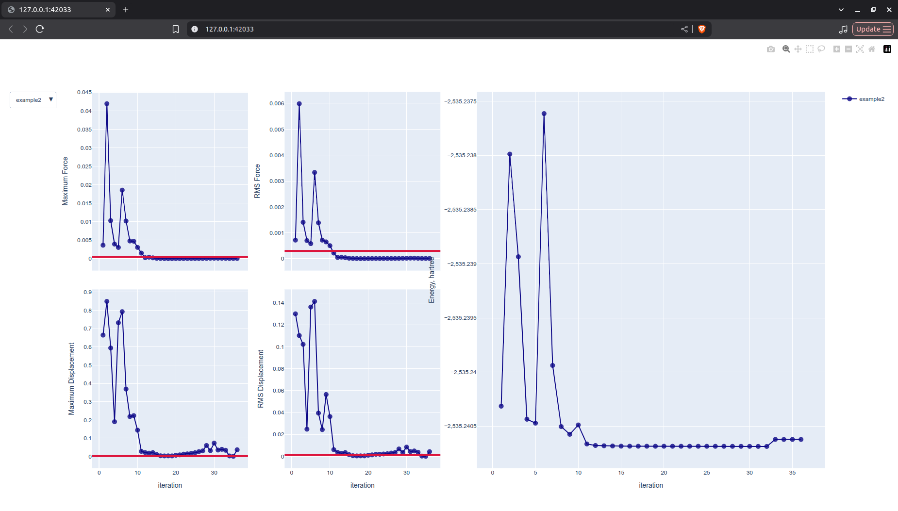

optmulti
========

.. important::

   The libraries :code:`matplotlib` and :code:`plotly` should be installed. 

.. highlight:: sh

.. argparse::
   :module: pyssianutils.plot.optmulti
   :func: parser
   :prog: pyssianutils plot optmulti

.. highlight:: default

Examples
--------

The main use-case of this util is to quickly visualize the status of the 
convergence of multiple geometry optimizations, simultaneously visualizing the 
thresholds for convergence and the various parameters used to assess convergence,
including the potential energy. For this use case

For an interactive view (running a command that will prompt a window with the 
figures that allows us to zoom in at will): 

.. code:: shell-session

   $ pyssianutils plot optmulti example.log example2.log --browser
   Opening in existing browser session.

|optmulti_example_all|

We can notice a dropdown menu on the left allows us to select a specific 
calculation, which cleans all the figures and only displays the information 
of the one that we selected: 

|optmulti_example_single|

We can also do the same action by clicking on the legend at the right. On each 
of the plots we can zoom in, if we have troubles seeing the data and the x-axis
will sincronize across the various figures. This can be usefull for selecting an
appropriate geometry to re-start a calculation as we can visually inspect which
geometries were the closest to converging.