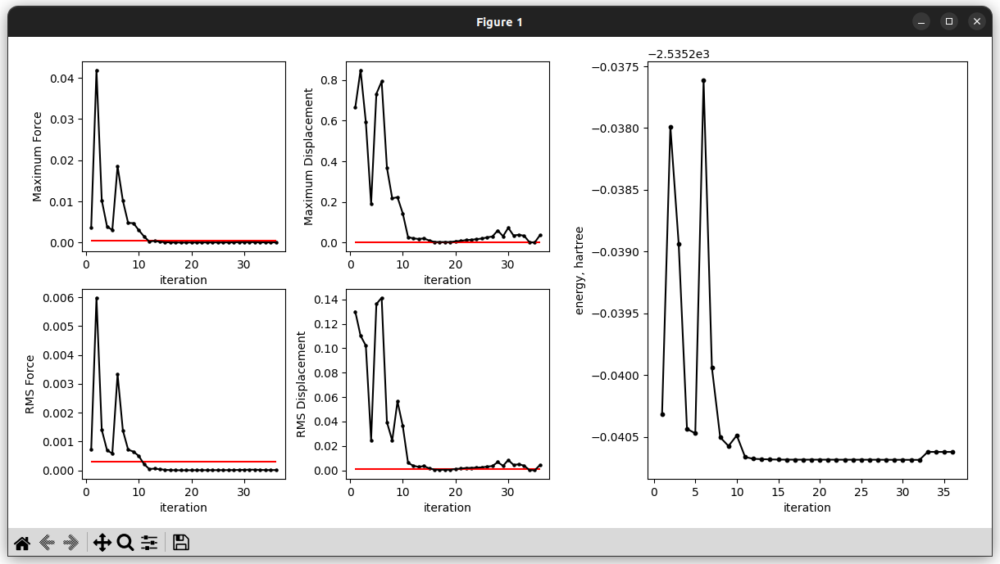

optview
=======

.. highlight:: sh

.. argparse::
   :module: pyssianutils.plot.optview
   :func: parser
   :prog: pyssianutils plot optview

.. highlight:: default

Examples
--------

The main use-case of this util is to quickly visualize the status of the 
convergence of a geometry optimization, simultaneously visualizing the 
thresholds for convergence and the various parameters used to assess convergence,
including the potential energy. If instead multiple calculations want to be 
inspected we recommend using instead :doc:`optmulti`

For an interactive view (running a command that will prompt a window with the 
figures that allows us to zoom in at will): 

.. code:: shell-session

   $ pyssianutils plot optview Example.log --interactive

|optview_example|

.. note:: 

   As of now we have more or less patched the interactive view of the figure
   to not look horrible. However, for those users that aesthetics of the 
   generated figure are important we recommend the generation of the image
   file and then visualizing it. 

