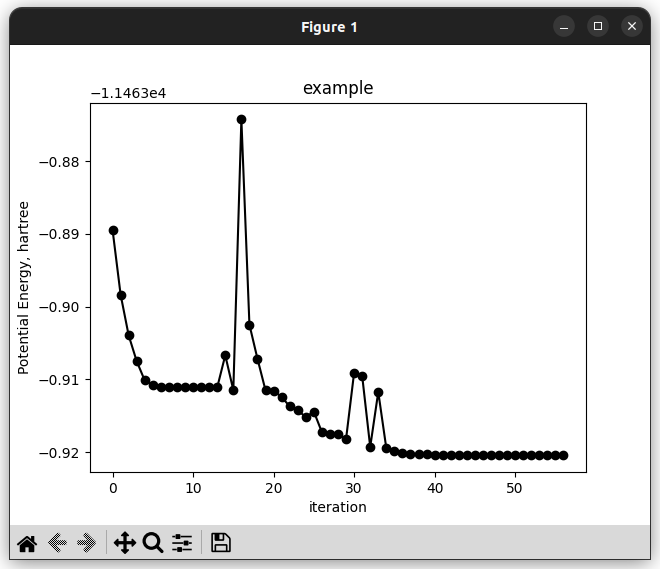
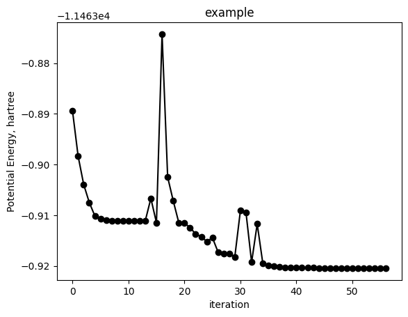
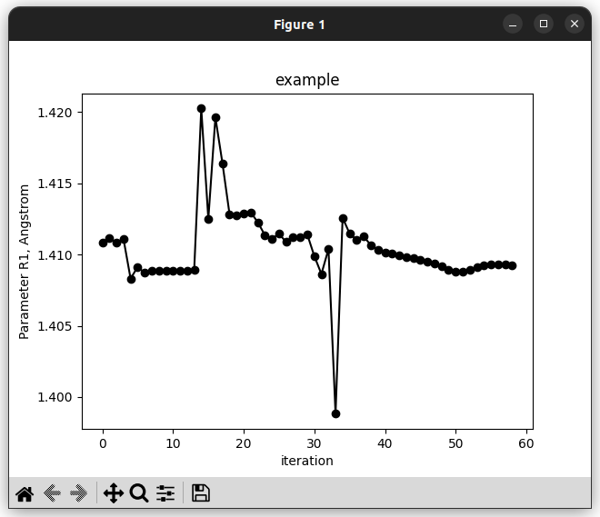
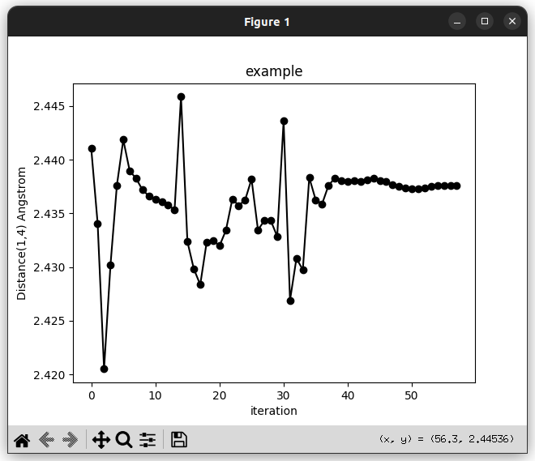

property
========

.. automodule:: pyssianutils.plot.property

Currently 3 possible "properties" may be drawn: 

.. contents::
   :local:
   :depth: 1

energy
------

.. highlight:: sh

.. argparse::
   :module: pyssianutils.plot.property
   :func: energy
   :prog: pyssianutils plot property energy

.. highlight:: default

parameter
---------

.. highlight:: sh

.. argparse::
   :module: pyssianutils.plot.property
   :func: parameter
   :prog: pyssianutils plot property parameter

.. highlight:: default

geometry
--------

.. highlight:: sh

.. argparse::
   :module: pyssianutils.plot.property
   :func: geometry
   :prog: pyssianutils plot property geometry

.. highlight:: default

Examples
--------

All these tools are thought for quick visualizations of key properties. 
Specifically the potential energy, or any geometrical parameter (either an 
internal coordinate or some other distance/angle/dihedral).

For all the following examples we will assume that there is a file named 
:code:`Example.log` containing a gaussian optimization.

To draw the potential energy of :code:`Example.log`:, which might give us some 
insight into the convergence the optimization job: 

.. code:: shell-session

   $ pyssiantuils plot property energy Example.log --interactive

|energy_example_interactive|

which shows the "interactive" plot where we can zoom in/out at will. If we 
instead prefer to generate a png for later inspection we should omit the 
:code:`--interactive` flag. This will lead to the generation of an image file 
with a default name, or if we want to specify the name we can enable the 
:code:`--outfile` flag. 

.. code:: shell-session

   $ pyssiantuils plot property energy Example.log --outfile example.png
   writing -> example.png

|energy_example|

For a given internal parameter (we can visualize the defined parameters 
for a given file using :code:`pyssianutils others track`, see 
:doc:`../others`)

.. code:: shell-session

   $ pyssiantuils plot property parameter Example.log R1 --interactive

|parameter_example|

Or if we are interested in a geometrical parameter and we are not sure if it 
is part of the internal coordinates, we can instead use :code:`plot geometry`
where we will specify the indices of the involved atoms. Specifying 2 atoms will
give us a distance, 3 an angle, and 4 a dihedral angle. 

.. code:: shell-session

   $ pyssiantuils plot property geometry Example.log R1 1 4 --interactive

|geometry_example|

